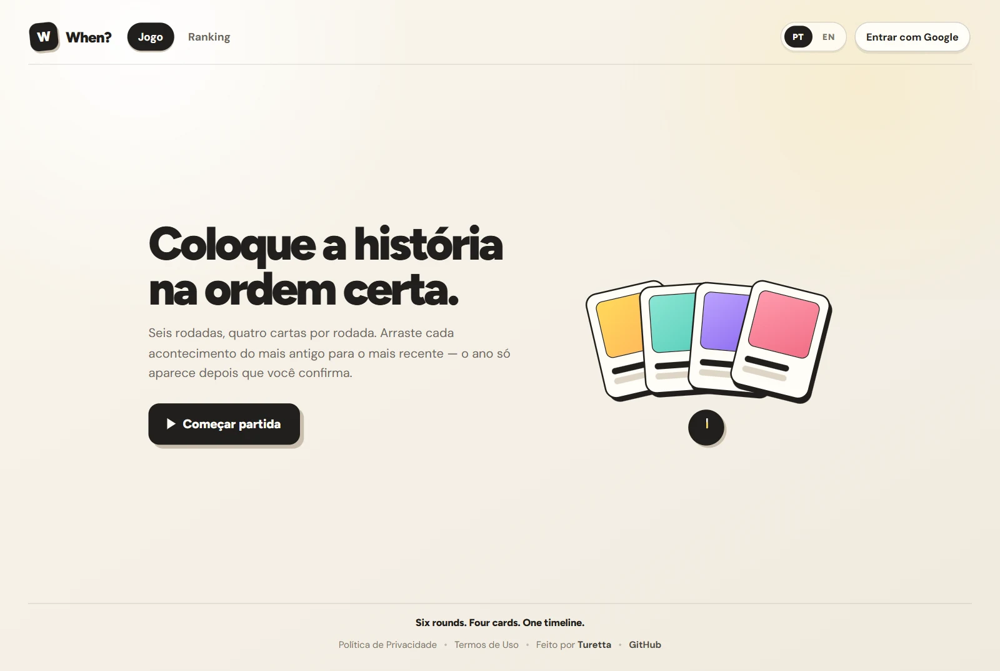
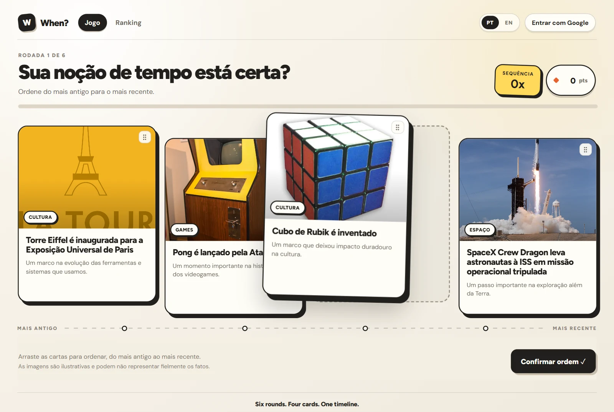
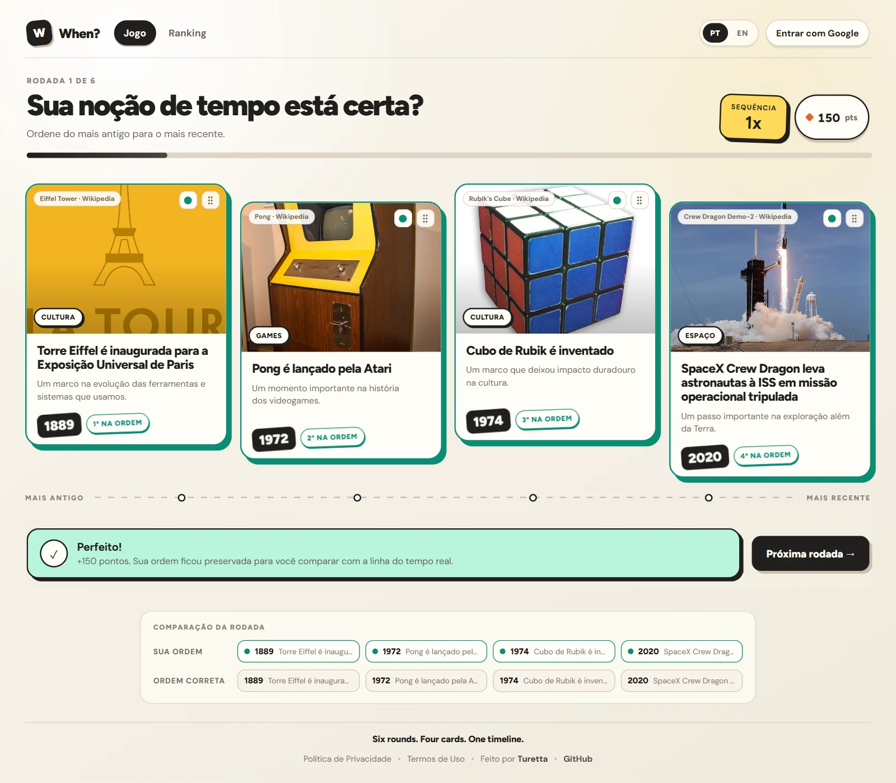
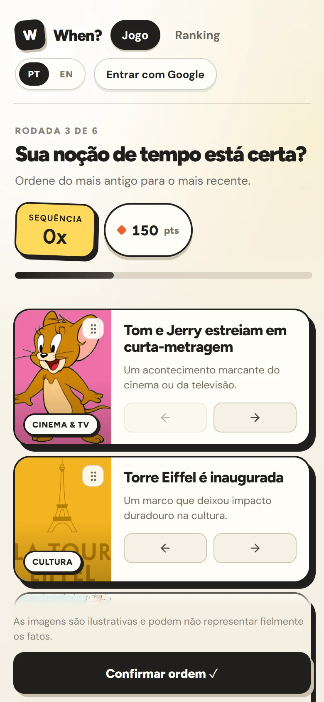
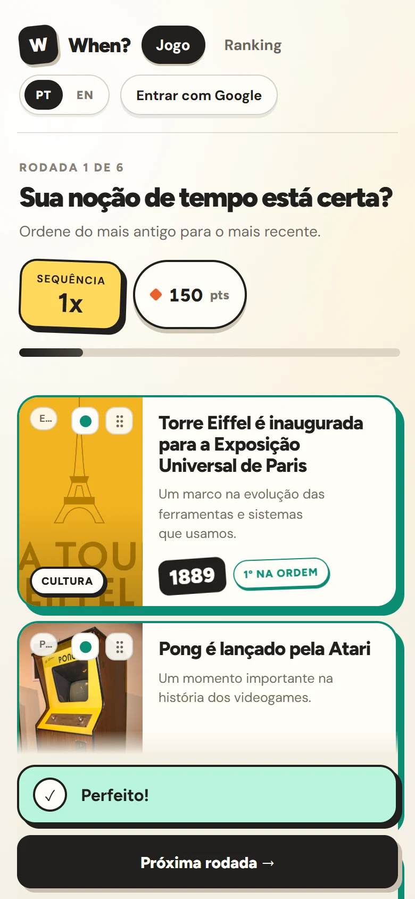
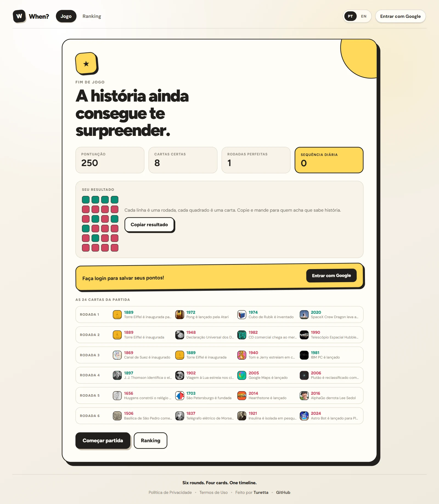

<div align="center">


# When?

### Six rounds. Four cards. One timeline.

**Você sabe *quando* aconteceu… ou só acha que sabe?**

[](https://playwhen.netlify.app/)


<br />



</div>

---

## 🕰️ O que é isso?

**When?** é um jogo de cronologia para navegador. A regra cabe num tweet:

> Quatro acontecimentos aparecem embaralhados. Coloque do **mais antigo** para o **mais recente**. O ano só aparece depois que você confirma.

Parece fácil até o jogo perguntar o que veio primeiro: o **Cubo de Rubik**, o **Pong** ou a **Torre Eiffel**. (Spoiler: a Torre Eiffel está *bem* na frente. O Pong e o Cubo são separados por dois anos e muita falsa confiança.)

São **500 fatos** e contando, misturando história, ciência, tecnologia, espaço, games, cinema, música, esportes, internet e Brasil. Com milhares de combinações possíveis, dificilmente você vai decorar as respostas.

---

## 🎴 Como se joga

<table>
<tr>
<td width="62%">

</td>
<td>

**1. Arraste.** Pegue uma carta e solte onde ela deve ficar. As outras deslizam para abrir espaço, e um contorno tracejado mostra onde ela vai cair.

**2. Confirme.** Quando a linha do tempo fizer sentido na sua cabeça, confirme a ordem.

**3. Encare a verdade.** Os anos aparecem *sem* reorganizar nada, então dá para ver exatamente onde a sua intuição tropeçou.

</td>
</tr>
</table>

<div align="center">

</div>

Cada partida tem **6 rodadas**, ou seja, 24 cartas. No fim, você recebe um resumo completo e uma grade de emojis pronta para mandar no grupo da família.

```text
When? — 470 pts
🟩🟩🟥🟥
🟥🟩🟥🟩
🟩🟩🟩🟩
```

---

## 🏆 Pontuação

| Situação | Pontos |
| --- | --- |
| Cada carta na posição certa | **+25** |
| Rodada perfeita (4/4) | **+50** de bônus |
| Rodadas perfeitas seguidas | **+20** por perfeito anterior na sequência |

Errou uma carta? A sequência de perfeitos volta a zero. A história não perdoa.

Quem entra com o Google ganha ainda:

- **Ranking global**: o Top 10 por pontuação acumulada, com bandeira do país e nickname
- **Sequência diária** 🔥: mantida enquanto você jogar pelo menos uma vez por dia, a gente congela ela somente por dois dias eim
- **3 partidas ranqueadas por dia**: o suficiente para melhorar, pouco demais para virar vício (em tese)

---

## 📱 Feito para o celular também

<table>
<tr>
<td align="center" width="50%"></td>
<td align="center" width="50%"></td>
</tr>
<tr>
<td align="center"><sub>Arraste com o dedo ou use as setas ◀ ▶</sub></td>
<td align="center"><sub>Feedback e próxima rodada sempre à mão</sub></td>
</tr>
</table>

---

## ✨ Destaques

- 🎯 **Jogue sem cadastro.** O modo visitante roda a partida inteira sem gravar nada.
- 🔐 **Login opcional com Google**, usado só para salvar pontos e aparecer no ranking.
- 🧲 **Drag-and-drop de verdade**, com mouse, toque e teclado, animações suaves e poeirinha quando a carta pousa.
- 💾 **Retomar partida.** Trocou de tela ou recarregou a página no meio do jogo? Ele continua de onde parou.
- 🌎 **Bilíngue** (PT-BR e EN). O nome continua **When?** em qualquer idioma.
- 🖼️ **Imagens da Wikipedia**, com crédito e link para a fonte. São ilustrativas e nem sempre retratam o fato com precisão.
- 📋 **Resultado compartilhável** em emojis, com um clique para copiar.

<div align="center">

</div>

---

## 🔒 Privacidade, sem letras miúdas

- **Visitantes:** nenhum registro de tentativas, partidas, pontuação ou analytics é criado.
- **Jogadores logados:** o ranking mostra apenas **nickname, bandeira do país, partidas e pontuação**. Foto, nome e e-mail da conta Google nunca são exibidos.
- **Pontuação à prova de trapaça:** as regras de segurança do banco validam cada rodada no servidor. O cliente não pode simplesmente anunciar "fiz 9.999 pontos".

Os detalhes completos ficam nas páginas de **Política de Privacidade** e **Termos de Uso**, dentro do próprio jogo.

---

## 🧱 Por baixo do capô

| Camada | Tecnologia |
| --- | --- |
| Interface | React 18 + Vite 6 |
| Arrastar e soltar | dnd-kit (core + sortable) |
| Autenticação | Firebase Authentication (Google) |
| Dados e ranking | Cloud Firestore, com regras de segurança validando a pontuação |
| Métricas | Firebase Analytics (apenas para usuários logados) |
| Ícones | lucide-react |
| Hospedagem | Firebase Hosting |

### Estrutura do projeto

O código é organizado por **funcionalidade**: cada parte do jogo tem sua própria pasta, com componentes, hooks e serviços próprios.

```text
src/
├── app/              Shell da aplicação, providers e roteador
├── components/       UI compartilhada (layout e componentes base)
├── config/           Rotas, chaves de armazenamento e constantes
├── features/
│   ├── auth/         Login com Google, perfil e nickname
│   ├── game/         Estado da partida, rodadas, cartas, drag-and-drop e pontuação
│   ├── home/         Tela inicial
│   ├── leaderboard/  Ranking Top 10
│   ├── legal/        Privacidade e termos
│   ├── onboarding/   Tutorial da primeira partida
│   └── results/      Fim de jogo, resumo e compartilhamento
├── hooks/            Hooks genéricos
├── i18n/             Provider de idioma e traduções PT-BR / EN
├── lib/              Firebase, analytics, storage e utilitários
└── styles/           Tokens de design e CSS dividido por área
```

---

## 🚀 Rodando localmente

**Pré-requisitos:** Node.js 18+ e um projeto Firebase próprio com Authentication (Google) e Firestore habilitados.

```bash
git clone https://github.com/HigorTuretta/play-when.git
cd play-when
npm install
```

Crie um arquivo `.env` a partir do exemplo e preencha com as credenciais do **seu** projeto Firebase:

```bash
cp .env.example .env
```

```bash
npm run dev
```

| Script | O que faz |
| --- | --- |
| `npm run dev` | Servidor de desenvolvimento com hot reload |
| `npm run build` | Build de produção em `dist/` |
| `npm run preview` | Serve o build localmente |
| `npm run seed:firestore` | Popula `facts/`, `rounds/`, `roundAnswers/` e `public/rounds/` a partir de `private-data/facts.json` |
| `npm run export:rounds` | Regenera `public/rounds/` a partir do que já está no Firestore (sem `facts.json` em mãos) |
| `npm run validate:facts` | Valida `private-data/facts.json` (duplicatas, datas, referências, títulos em inglês) |
| `npm run validate:rounds` | Valida o que está publicado em `public/rounds/` (uma carta por categoria, sem repetir evento, sem ano no título) |
| `npm run retext:rounds` | Reescreve só o texto das cartas publicadas a partir de `data/event-titles-*.json`, sem reseed |
| `npm run emulators` | Sobe os emuladores de Auth + Firestore (projeto `demo-play-when`, isolado da produção) |
| `npm run dev:emulators` | Servidor de desenvolvimento apontando para os emuladores acima |
| `npm run test:rules` | Roda os testes das Security Rules (`tests/firestore.rules.test.mjs`) no emulador |

> O arquivo `.env` é ignorado pelo Git. Nunca faça commit de credenciais.

### Rodadas: ranqueadas vs. visitante

As 2.500 rodadas são divididas em duas faixas (`RANKED_POOL_SIZE` em [constants.js](src/features/game/constants.js) e `validRankedRoundId()` em [firestore.rules](firestore.rules)):

- **`round-0001` a `round-2250`** — ranqueadas. O cliente busca as cartas em `public/rounds/v2/`, mas o gabarito (`roundAnswers/`) só fica no Firestore e só é liberado depois que a tentativa do jogador é registrada.
- **`round-2251` a `round-2500`** — visitante. Gabarito incluído no próprio arquivo estático em `public/rounds/v2/`, então o modo visitante roda 100% sem tocar no Firestore.

`npm run seed:firestore` (ou `npm run export:rounds`) gera esses arquivos junto com o Firestore. Se o conteúdo das rodadas mudar, ajuste `STATIC_ROUNDS_VERSION` em [scripts/lib/rounds.mjs](scripts/lib/rounds.mjs) e `STATIC_ROUNDS_URL` em [constants.js](src/features/game/constants.js) — os arquivos são servidos com cache imutável.

> `public/rounds/v1` continua no repositório só para as abas que ainda estejam rodando o bundle antigo no momento do deploy. Pode ser apagado no release seguinte.

### Texto das cartas

- **Título em português**: vem de `private-data/facts.json`; `data/event-titles-pt.json` sobrescreve os poucos casos que precisam mudar (por exemplo, um título que entregava o ano).
- **Título em inglês**: vem de `data/event-titles-en.json`, um por evento. Antes o campo carregava a busca usada para achar a imagem na Wikipedia — muitas vezes só um fragmento ("Magna Carta") e, em 38 cartas, com o ano no meio, entregando a resposta a quem jogava em inglês.
- **Descrição da carta**: não é publicada nos arquivos de rodada. O cliente monta a partir da categoria (`categoryShort` em [pt-BR.js](src/i18n/locales/pt-BR.js) e [en.js](src/i18n/locales/en.js)), então uma carta de Transportes não tem como aparecer descrita como cinema.

Mudou só o texto? `npm run retext:rounds` reescreve os arquivos publicados sem reseed — o gabarito no Firestore é indexado por rodada e por carta, e nenhum dos dois muda. Lembre de subir `STATIC_ROUNDS_VERSION` antes, porque `/rounds/**` é servido com cache imutável.

### Como uma rodada é montada

Cada rodada sorteia **quatro categorias diferentes** e **quatro anos diferentes** (`makeRound()` em [scripts/seed-firestore.mjs](scripts/seed-firestore.mjs)). Sem a regra de categoria, quase metade das rodadas repetia assunto — e havia rodadas com as quatro cartas da mesma categoria. A regra vale para as rodadas geradas a partir daí: rode `npm run seed:firestore` para reconstruir o acervo e `npm run validate:rounds` para conferir.

### App Check (opcional, recomendado em produção)

Preencha `VITE_APPCHECK_SITE_KEY` no `.env` com uma chave do **reCAPTCHA Enterprise** para ativar o [Firebase App Check](https://firebase.google.com/docs/app-check): ele passa a exigir que as requisições ao Firestore venham do app de verdade, não de scripts usando a chave pública. Ative o enforcement no console do Firebase depois de confirmar as métricas. Em desenvolvimento, use `VITE_APPCHECK_DEBUG_TOKEN` com um token de depuração registrado no console.

---

## 🇺🇸 In English

**When?** is a browser chronology game: four shuffled historical events, sort them from **oldest to newest**, and the years are only revealed after you commit. Six rounds, 24 cards, 500 facts across history, science, tech, space, games, film, music, sports and more.

- Play instantly as a guest (nothing is stored), or sign in with Google to save scores, keep a daily streak and climb the global Top 10.
- Scoring: **+25** per correct card, **+50** for a perfect round, plus **+20** for each consecutive perfect before it.
- Drag-and-drop with mouse, touch or keyboard; mid-game progress survives page switches and reloads.
- Fully bilingual (PT-BR / EN), with shareable emoji results.
- Built with React, Vite, dnd-kit and Firebase, with scores validated server-side by Firestore security rules.
- Every round deals four different categories and four different years, and card titles never contain the year.

---

## 📄 Créditos e avisos

- Imagens carregadas da **Wikipedia / Wikimedia Commons**, sujeitas às licenças indicadas pela fonte. O jogo exibe o crédito de cada imagem.
- Algumas datas históricas usam datação tradicional ou aproximada quando não existe uma data moderna exata.
- O licenciamento do código é definido pelo autor do repositório.

<div align="center">

<br />

Feito com ☕ e uma pitada de anacronismo por **[Turetta](https://github.com/HigorTuretta)**

<sub>Six rounds. Four cards. One timeline.</sub>

</div>
